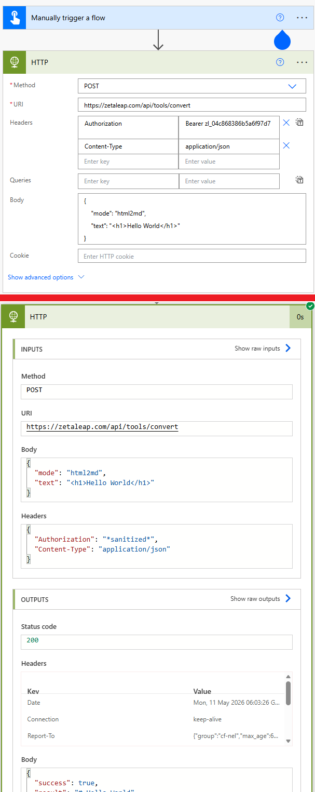

# Format Converter API
Seamlessly convert between Markdown and HTML with this high-performance API. Designed for developers and automation workflows, it ensures accurate formatting transitions for documentation, emails, and web content.

## How It Works
1. **Input Selection:** Choose your conversion mode—either "Markdown to HTML" or "HTML to Markdown".
2. **Text Processing:** Paste your source content into the input editor. The system performs a real-time conversion.
3. **API Integration:** For automated tasks, send a POST request to the API endpoint with your content and desired mode.
4. **Validation:** The system checks for a 100KB payload limit to ensure optimal performance and security.

## Features
- **Bi-directional Conversion:** Supports both MD to HTML and HTML to MD transitions.
- **Real-time Preview:** Instant conversion as you type in the web interface.
- **Enterprise API:** Reliable endpoint for Power Automate, Logic Apps, or custom scripts.
- **Clean Output:** Generates standard-compliant HTML and clean, readable Markdown.

## Requirements
- **Zetaleap Account:** Required for API access.
- **API Token:** A valid Bearer token from your profile page for programmatic use.

## Getting Started
1. Access the **Tools** section from the Zetaleap dashboard.
2. Select your desired conversion mode from the toggle.
3. Paste your text to see the instant result, or use the provided **cURL** example to integrate it into your flow.

## API example
 
```bash
curl -X POST "https://zetaleap.com/api/tools/convert" \
  -H "Authorization: Bearer YOUR_TOKEN" \
  -H "Content-Type: application/json" \
  -d '{"mode":"md2html","text":"# Hello World"}'
```
 

